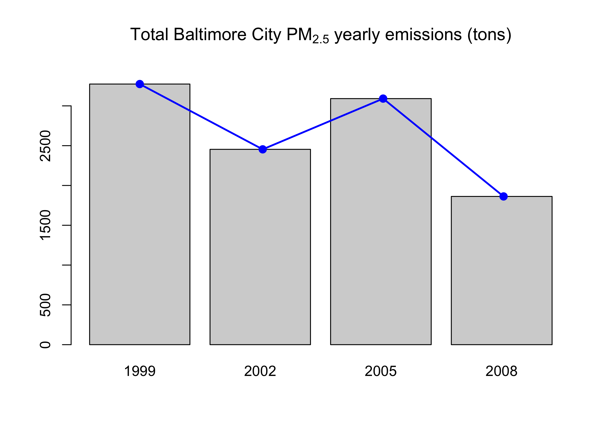
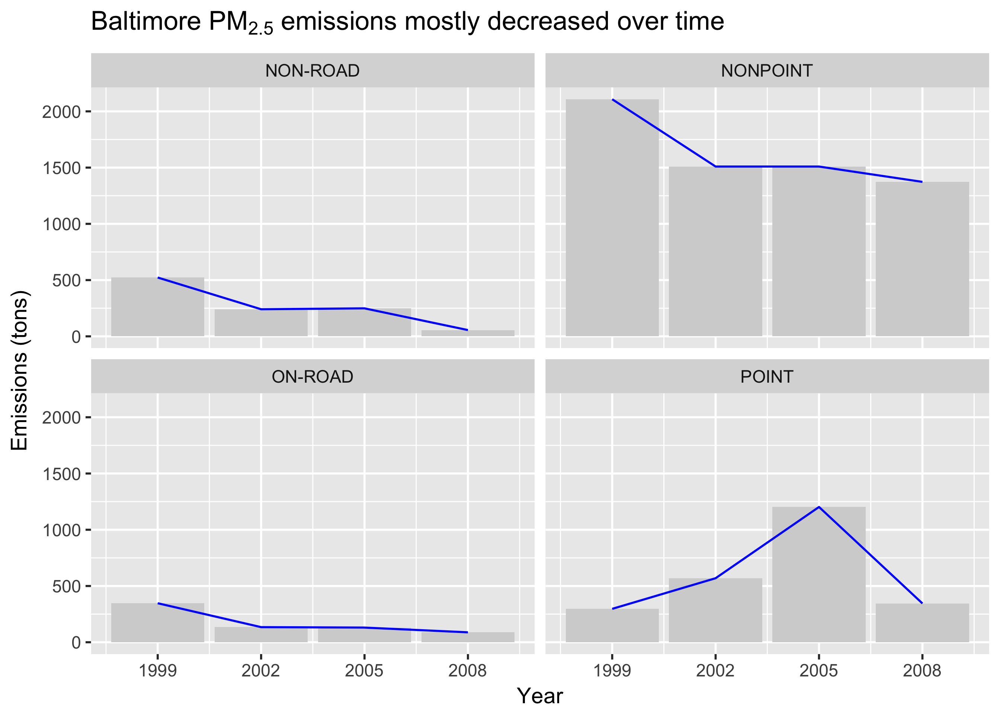
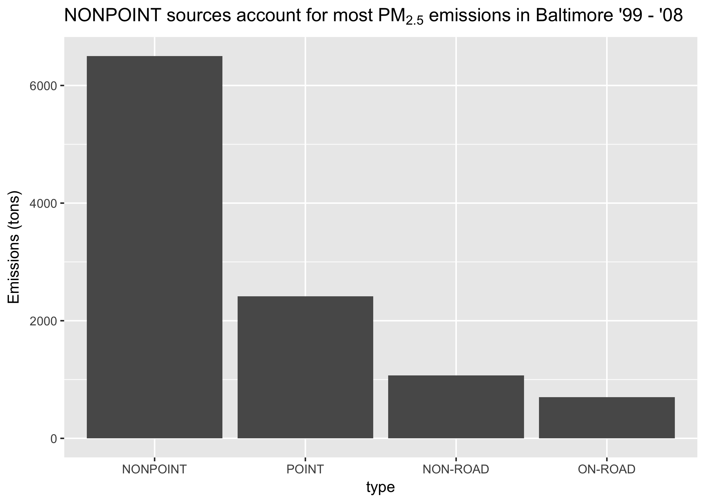
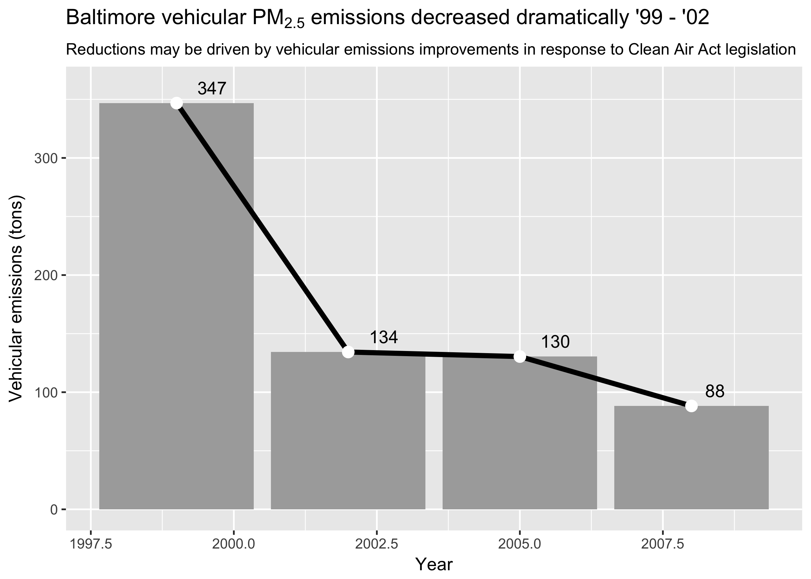
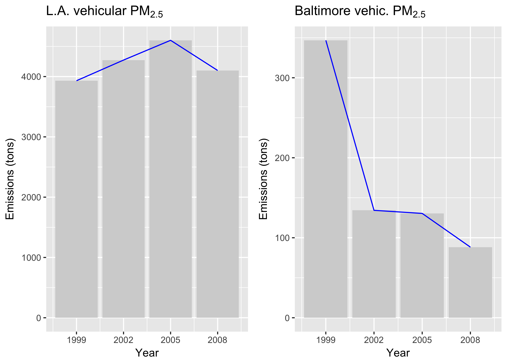

# Project 2 - Exploratory Data Science Coursera
Chris Sirico  
11/7/2017  


1. **Have total emissions from PM2.5 decreased in the United States from 1999 to 2008? Using the base plotting system, make a plot showing the total PM2.5 emission from all sources for each of the years 1999, 2002, 2005, and 2008.**

Emissions did, in fact, decrease steadily from '99 to '08. (Wildfires were the single greatest contributor in years '99-'05, but didn't significantly effect the trend.)

```r
#create df summing emissions by year
uspm <- NEI %>% group_by(year) %>%
  sum_emissions

bigass_df <- bigass_df %>% 
  mutate(
  Is.Fire = str_detect(EI.Sector, "Fires - Wildfires")
)

fire <- bigass_df %>% group_by(year, Is.Fire) %>%
  sum_emissions() %>% 
  spread(year, Emissions) %>% select(-Is.Fire)

# Base R stacked bar plot
barplot(height = as.matrix(fire),
        col = c(1, 2),
        legend.text = c("All others", "Wildfire emissions"),
        args.legend = list(x = "topright"));
title(main = expression('Total US PM'[2.5]*' yearly emissions (tons)'))
```


```r
# graph the years 99, 02, 05, 08 (without fires)
# barplot(uspm$year, height = as.matrix(tidyr::spread(uspm, year, Emissions)))
# title(main = expression('Total US PM'[2.5]*' yearly emissions (tons)')) # use cmd+shift+enter to run whole chunk and this title displays properly
# analyze per capita and by GDP.
```

##Intervening factors


GDP growth slowed during the dot-com bust in 2000, recovered, and then reversed at the beginning of the 2008 financial crisis. Real GDP grew by 23% over the 10 years observed, while crude oil production only increased by 12% (source: [IndexMundi](https://www.indexmundi.com/energy/?product=oil&graph=production)). The major industries of manufacturing, contruction and mining also saw increases in gross output during the period (source: [bea.gov](https://bea.gov)). This seems to suggest that emissions sources became cleaner, not less active, during the period.

[See GDP history by year](https://www.thebalance.com/us-gdp-by-year-3305543).


I suspect decreases in particulate emissions were in response to the [Clean Air Act](https://www.epa.gov/clean-air-act-overview/progress-cleaning-air-and-improving-peoples-health#pollution) legislation.

There were some changes in the way data were collected for the 2008 version of the NEI report (some categories were flat-lined) that could lead to lower-than-expected values compared to previous years. Click the first link on this page for more information: [Air Pollutant Emissions Trends Data](https://www.epa.gov/air-emissions-inventories/air-pollutant-emissions-trends-data)


2. **Have total emissions from PM2.5 decreased in the Baltimore City, Maryland (𝚏𝚒𝚙𝚜 == "𝟸𝟺𝟻𝟷𝟶") from 1999 to 2008? Use the base plotting system to make a plot answering this question.**

Yes, emissions decreased in Baltimore.


```r
bcpm <- NEI %>% filter(fips == "24510") %>% 
  group_by(year) %>%
  summarise(Emissions = sum(Emissions))

# graph the years 99, 02, 05, 08
barplot(bcpm$year, height = as.matrix(tidyr::spread(bcpm, year, Emissions)))
title(main = expression('Total Baltimore City PM'[2.5]*' yearly emissions (tons)'))
```




3. **Of the four types of sources indicated by the 𝚝𝚢𝚙𝚎 (point, nonpoint, onroad, nonroad) variable, which of these four sources have seen decreases in emissions from 1999–2008 for Baltimore City? Which have seen increases in emissions from 1999–2008? Use the ggplot2 plotting system to make a plot answer this question.**


```r
# percent change from 99 to 08 by type in Baltimore
bc_type <- NEI %>% filter(fips == "24510", year == 1999 | year == 2008) %>% 
  group_by(year, type) %>%
  summarise(Emissions = sum(Emissions)) %>%
  ungroup() %>% 
  group_by(type) %>%
  spread(year, Emissions) %>% 
  summarise(PercentChange = (`2008`-`1999`) / `1999`, # add a column showing % change from beginning to end of period
            positive = PercentChange >= 0) # create positive / negative column for bar colors
bc_type$type <- with(bc_type, reorder(type, PercentChange, median))

# create data for emissions over time by plots (one per type)
bc_years <- NEI %>% filter(fips == "24510") %>% 
  group_by(year, type) %>%
  summarise(Emissions = sum(Emissions)) %>%
  ungroup() %>% 
  group_by(type)

ggplot(bc_type, aes(type, PercentChange)) +
  geom_col(aes(fill = positive)) +
  scale_y_continuous(labels = scales::percent) +
  labs(
    title = expression('Baltimore PM'[2.5]*' emissions mostly decreased \'99 - \'08'),
    subtitle = "With exception of point sources, this follows national trend",
    x = "Source type",
    y = "Change from 1999 to 2008"
  ) +
  geom_text(aes(label=percent(PercentChange),
            hjust=ifelse(sign(PercentChange) > 0, 1.5, -.5)),
            position = position_dodge(width=1)) +
  coord_flip() +
  guides(fill=FALSE)
```


```r
# facet plot: emissions vs. time by type
ggplot(bc_years, aes(year, Emissions)) +
  geom_col() +
  labs(title = expression('Baltimore PM'[2.5]*' emissions mostly decreased over time')) +
  xlab("Year") +
  ylab("Emissions (tons)") +
  scale_x_continuous(breaks = c(1999, 2002, 2005, 2008)) +
  facet_wrap(~type, nrow = 2)
```



A note on **source types**:
"POINT" refers to a fixed geographic source. "NONPOINT" refers to distributed activity, such as use of solvents or burning at multiple locations. "ON-ROAD" refers to vehicular sources (fueling, idling, and driving on roads & parking lots). "NON-ROAD" refers to emissions from use of gasoline, diesel or similar fuels by machines and vehicles not operating on roadways.

POINT emissions seem to have been at an unusual low in 1999, resulting in the positive trend shown above. 2008 has the lowest POINT emissions of all years observed except for 1999.

See the below graph for a sense of proportion amongst emission types in Baltimore during the years observed.


```r
bc_type_sum <- NEI %>% filter(fips == "24510") %>% 
  group_by(type) %>%
  summarise(Emissions = sum(Emissions))

ggplot(data = bc_type_sum, aes(x = type, y = Emissions)) +
  geom_col() +
  labs(title = expression('NONPOINT sources account for most PM'[2.5]*' emissions in Baltimore \'99 - \'08'),
    y = "Emissions (tons)"
  )
```




4. **Across the United States, how have emissions from coal combustion-related sources changed from 1999–2008?**

To find the data, we first search NEI dataset for all mentions of "coal", remove non-combustion categories, and finally summarize.


```r
library(stringr)

# Look for mentions of coal, then filter out non-combustion categories.
# This was the most time-consuming part of this project
bigass_df <- left_join(NEI, SCC)
all_coal <- bigass_df %>%
  filter( # Look for "coal" in text columns
    str_detect(Short.Name, "[Cc]oal") |
    str_detect(EI.Sector, "[Cc]oal") |
    str_detect(SCC.Level.One, "[Cc]oal") |
    str_detect(SCC.Level.Two, "[Cc]oal") |
    str_detect(SCC.Level.Three, "[Cc]oal") |
    str_detect(SCC.Level.Four, "[Cc]oal")
    ) %>%
  filter( # getting rid of some large buckets of irrelevant results
   !(str_detect(EI.Sector, "Mining")) &
   !(str_detect(EI.Sector, "Storage and Transfer")) 
    &
   !(str_detect(Short.Name, "Charcoal"))
   )%>%
  arrange(desc(Emissions)) # Arrange by emissions to filter out high-impact irrelevant results first
# Let's focus in on non-"fuel combustion" sources to separate out any other irrelevant results
coal_non_fuel_comb <- all_coal %>% 
  filter(!str_detect(EI.Sector, "Fuel Comb"))
# Keep anything "Kiln", "Fuel," "Coal-fired"
coal_non_fuel_comb_include <- coal_non_fuel_comb %>%
  filter(str_detect(Short.Name, "(Kiln)|(Fuel)|(Coal\\-fired)"))

# Coal grafitization, preheaters (coke manufacture), and other types of handling are the anomalies that remain.
# These aren't relevant to our exploration, so we'll filter them out.
coal_anomalies <- anti_join(coal_non_fuel_comb, coal_non_fuel_comb_include)
all_coal <- anti_join(all_coal, coal_anomalies)
all_coal <- filter(all_coal,
   !str_detect(Short.Name, "Grafitization") &
   !str_detect(Short.Name, "Handling") &
   !str_detect(Short.Name, "Crushing") &
   !str_detect(Short.Name, "Preheater") &
   !str_detect(Short.Name, "Screening")
)
# all_coal$year <- factor(all_coal$year) # re-class year as factor for plotting

# Finally(!), let's sum emissions.
all_coal_sum <- all_coal %>% group_by(year) %>%
  summarise(Emissions = sum(Emissions)) 

# And plot findings
ggplot(all_coal_sum, aes(year, Emissions)) +
  geom_col() +
  labs(
    title = expression('Nationwide coal-burning PM'[2.5]*' emissions decreased \'99 - \'08'),
    x = "Year",
    y = "Coal burning emissions (tons)"
  ) +
  scale_x_continuous(breaks = c(1999, 2002, 2005, 2008)) +
  # scale_x_date(date_labels = "%y") +
  geom_text(aes(label=plyr::round_any(Emissions, 1),
            vjust=2),
            position = position_dodge(width=1), color = "white") +
  guides(fill=FALSE)
```


5. **How have emissions from motor vehicle sources changed from 1999–2008 in Baltimore City?**


```r
bc_cars <- NEI %>% filter(fips == "24510" & type == "ON-ROAD") %>%
  group_by(year) %>%
  summarise(Emissions = sum(Emissions))

bc_cars$year <- factor(bc_cars$year)

ggplot(bc_cars, aes(year, Emissions)) +
  geom_col() +
  labs(
    title = expression('Baltimore vehicular PM'[2.5]*' emissions decreased dramatically \'99 - \'02'),
    subtitle = "Reductions may be driven by vehicular emissions improvements in response to Clean Air Act legislation",
    x = "Year",
    y = "Vehicular emissions (tons)"
  ) +
  scale_x_discrete(limits = rev(levels(all_coal_sum$year))) +
  # scale_x_date(date_labels = "%y") +
  geom_text(aes(label=plyr::round_any(Emissions, 1), vjust = 2),
            position = position_dodge(width=1), color = "white") +
  guides(fill=FALSE)
```



See more about the [Clean Air Act](https://www.epa.gov/clean-air-act-overview/progress-cleaning-air-and-improving-peoples-health#pollution).


6. **Compare emissions from motor vehicle sources in Baltimore City with emissions from motor vehicle sources in Los Angeles County, California (𝚏𝚒𝚙𝚜 == "𝟶𝟼𝟶𝟹𝟽"). Which city has seen greater changes over time in motor vehicle emissions?**

Population Histories:
[Baltimore](https://www.biggestuscities.com/city/baltimore-maryland) (Slight population decrease in period)
[Los Angeles](https://www.biggestuscities.com/city/los-angeles-california) (Slight population increase in period.)

L.A. has about 10x the population of Baltimore. Let's look at changes in motor vehicle emissions by year in terms of proportion of total as well as delta from beginning to end.

After in-depth analysis (see below appendix), the "on-road" category in the NEI data seems to be the right bucket.


```r
onroad <- bigass_df %>% filter(type == "ON-ROAD") # All "on-road" sources

onroad_la <- onroad %>%
  filter(fips == "06037")

onroad_baltimore <- onroad %>%
  filter(fips == "24510")

la_sum <- group_by(onroad_la, year) %>%
  sum_emissions %>% tibble::as.tibble() %>% 
  dplyr::rename(LosAngeles = Emissions)

balt_sum <- group_by(onroad_baltimore, year) %>%
  sum_emissions %>% tibble::as.tibble() %>% 
  dplyr::rename(Baltimore = Emissions)

la_v_balt <- left_join(la_sum, balt_sum, key = "year") # put la and baltimore summaries into one object

# let's convert years to density
la_total <- summarise(la_sum,
                      LosAngeles = sum(LosAngeles)
                      )[[1,1]]
balt_total <- summarise(balt_sum,
                      Baltimore = sum(Baltimore)
                      )[[1,1]]

# gather cities into one column for plotting
la_v_balt_density <- la_v_balt %>% group_by(year) %>%
  summarise(LosAngeles = LosAngeles / la_total,
            Baltimore = Baltimore / balt_total) %>%
  gather(City, Emissions, -year) %>% group_by(City)

# percent change by city for labeling
la_percent_change <- (la_v_balt_density[[4, "Emissions"]] - la_v_balt_density[[1, "Emissions"]]) / la_v_balt_density[[1, "Emissions"]]
balt_percent_change <- (la_v_balt_density[[8, "Emissions"]] - la_v_balt_density[[5, "Emissions"]]) / la_v_balt_density[[5, "Emissions"]]

# Plot findings
ggplot(la_v_balt_density) +
  geom_col(aes(x = year, y = Emissions, group = City, fill = City), position="dodge", width = 2.8) +
  scale_y_continuous(labels = scales::percent) +
  scale_x_continuous(breaks = c(1999, 2002, 2005, 2008)) + 
  geom_segment(
               x = (1999 - .7),
               y = la_v_balt_density$Emissions[5],
               xend = (2008 - .7),
               yend = la_v_balt_density$Emissions[8],
               color = "pink",
               lineend = "round"
               ) +
  geom_segment(x = (1999 + .7),
               y = la_v_balt_density$Emissions[1],
               xend = (2008 + .7),
               yend = la_v_balt_density$Emissions[4],
               color = "turquoise",
               lineend = "round") +
  labs(
    title = expression('Baltimore vehicular PM'[2.5]*' emissions decreased while LA\'s rose'),
    x = "Year",
    y = "Vehicular emissions (tons)"
  ) +
  
  annotate("text", x = (2002.5), y = (.42),
           label = str_c((percent(balt_percent_change)), "\nchange\n1999-2008"),
           color = "salmon", size = 3.5) +
  annotate("text", x = (2001), y = (.3),
           label = str_c((percent(la_percent_change)),"\nchange\n1999-2008"),
           color = "#129496", size = 3.5)
```


```r
# plots by count, one per city (not as useful):
library(gridExtra)

plot1 <- ggplot(la_v_balt) +
  geom_col(aes(year, LosAngeles)) +
  scale_x_continuous(breaks = c(1999, 2002, 2005, 2008)) +
  labs(title = expression('L.A. vehicular PM'[2.5]),
       x = "Year",
       y = "Emissions (tons)")

plot2 <- ggplot(la_v_balt) +
  geom_col(aes(year, Baltimore)) +
  scale_x_continuous(breaks = c(1999, 2002, 2005, 2008)) +
  labs(title = expression('Baltimore vehic. PM'[2.5]),
       x = "Year",
       y = "Emissions (tons)")

gridExtra::grid.arrange(gridExtra::arrangeGrob(plot1, plot2, nrow=1))
```



Baltimore has seen the bigger shift in on-road emissions, with a dramatic reduction between 1999 and 2002. The magnitude of the shift suggests a change in legislation, transit infrastructure or data collection methodology. Further investigation could help illuminate the cause of the shift.


## Appendix - categories exploration

This section contains insights about the data uncovered during analysis of whether "on-road" is an accurate bucket for vehicular sources. While this quick-and-dirty presentation isn't visual, it is included here to give an idea of the largest structural elements of the data.

**Insights:** 

* While gasoline- and diesel-related source categories account for a majority of the number of sources listed, they only represent 7.6% of the tonnage. Wildfires, open fires, marine vessels and coal-fired energy production are the single largest contributors by ton.

* Marine vessels show more emissions in-port than underway in this data. Perhaps the EPA doesn't measure emissions outside a limited range from US land mass. Actual PM2.5 contribution to US air quality may be underepresented in this category as a result. 

* Diesel as a category dominates vehicular particulate emissions with 1,225 ktons of emissions, both on-road and off-road.

* Gasoline emissions are only 430 ktons, less than half those of diesel.

* Non-road diesel equipment is responsible for more particulate than all on-road sources combined (606 ktons vs 580 ktons).

* Iron production is another big category, as are lime production and coal mining.

* Non-road gasoline sources include mostly recreational vehicles such as pleasure craft (boats), jetskis, snow mobiles and dirt bikes.


```r
# onroad contains all "on-road" sources (defined in la-v-balt chunk). Here are some other possible categories:
veh <- bigass_df %>% filter(str_detect(Short.Name, "Veh")) # Everything that contains "veh" (vehicle)
gas <- bigass_df %>% filter(str_detect(Short.Name, "Gasoline")) # Everything containing Gasoline fuel mention
diesel <- bigass_df %>% filter(str_detect(Short.Name, "Diesel")) # Everything containing Diesel fuel mention

# Large majority of NEI sources contain either "Gasoline" or "Diesel"; each makes up a little less than half of the list
bigass_df %>% sum_emissions() # 21.8 M tons
onroad %>% sum_emissions() # 580k tons
veh %>% sum_emissions() #620 k tons
gas %>% sum_emissions() + #430 k tons 
diesel %>% sum_emissions() # 1,225 k tons - lots extra here compared to on-road

# gasoline and diesel together as proportion of total pm25 emissions: 7.57%
(gas %>% sum_emissions() + #430 k tons 
diesel %>% sum_emissions()) / bigass_df %>% sum_emissions()

# Vehicles sources not including on-road. Small category by emissions (38k tons); Iron Production, Lime Production, Coal Mining, other industrial types of sources on the high emission end
veh_unique <- anti_join(veh, onroad)
veh_unique %>% sum_emissions()

# Gasoline sources not including on-road. Small (23k tons); Lots of Pleasure Craft (private boats) and other small personal vehicles / equipment on the high end
gas_unique <- anti_join(gas, onroad)
gas_unique %>% sum_emissions()

# Diesel sources not on-road. Big category - 884 k tons - more than on-road!
# Lots of diesel marine vessels on the high end; (port emissions seem to be higher than underway emissions--interesting)
# Lesser quantities from stationary & nonroad diesel equipment, but more sources
diesel_unique <- anti_join(diesel, onroad)
diesel_unique %>% sum_emissions()

# Let's look at diesel marine vessels: 115 k tons -- does not account for the majority of unique diesel emissions
# Non-road equipment looks like another big one once you get down past the very largest emission sources
diesel_marine <- diesel_unique %>%
  filter(str_detect(Short.Name, "Marine Vessels"))
diesel_marine %>% sum_emissions()

# Bingo. Non-road diesel equipment does in fact emit more fine particulate than all on-road sources combined. 606 k tons!
nr_equipment <- diesel_unique %>%
  filter(str_detect(EI.Sector, "Non-Road Equipment"))
nr_equipment %>% sum_emissions() 
```
