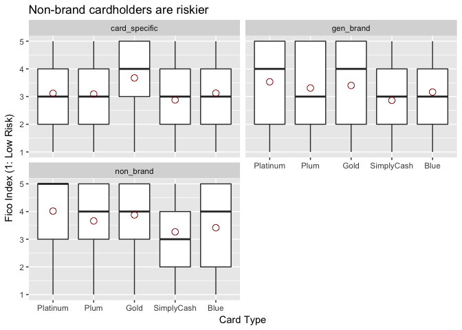

# Amex PS-to-Approval FICO & Spend

## Fico index by card type
<!-- -->

## Spend index by card type
<!-- -->

## Fico index by card and entry type
<!-- -->

<!-- -->

## Spend index by card and entry type
<!-- -->

<!-- -->

***

## Another look — boxplots with averages
This is the same data as above, visualized with boxplots and open circles representing average values.

<!-- -->

<!-- -->

<!-- -->

<!-- -->

