# R4DS ch 28 Exercises
Chris Sirico  

## 28.2.1 Exercises


1.  **Create one plot on the fuel economy data with customised `title`,
    `subtitle`, `caption`, `x`, `y`, and `colour` labels.**


```r
ggplot(mpg) +
  geom_jitter(aes(hwy, cyl, color = class), width = 0.2, height = 0.2) +
  geom_smooth(aes(hwy, cyl), se = FALSE) + 
  labs(
        title = "Fewer cylinders leads to better fuel economy",
    subtitle = "4-cylinder vehicles are most numerous and thus widely distributed",
    caption = "Data from fueleconomy.gov",
    x = "Highway fuel economy (mpg)",
    y = "number of cylinders",
    color = "Car type"
  )
```

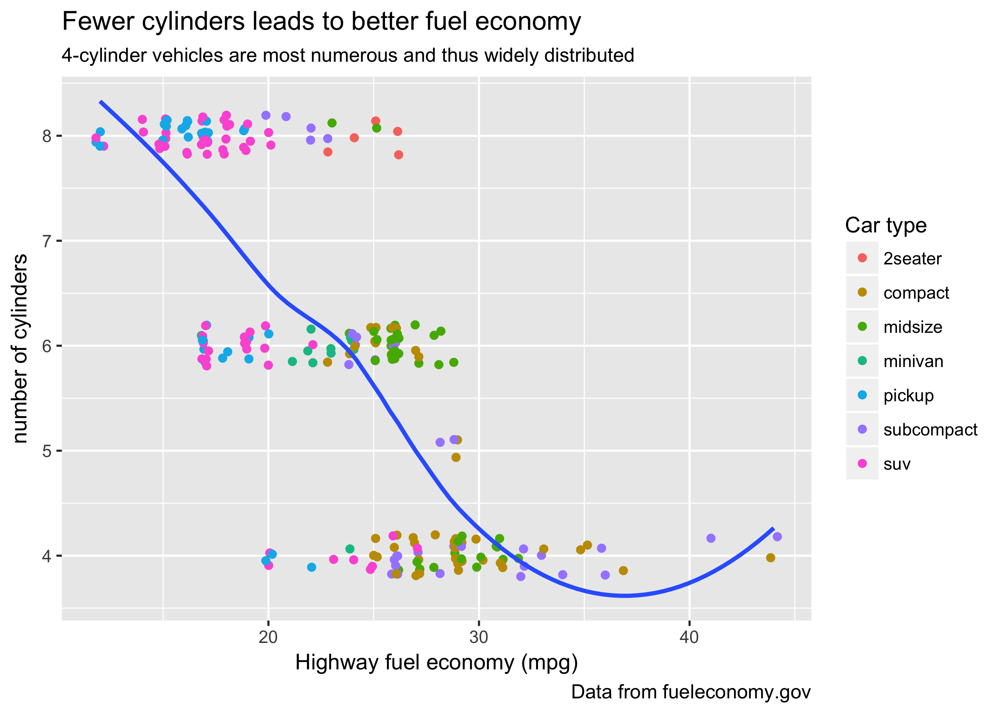


2.  **The `geom_smooth()` is somewhat misleading because the `hwy` for
    large engines is skewed upwards due to the inclusion of lightweight
    sports cars with big engines. Use your modelling tools to fit and display
    a better model.**


```r
mpg2 <- filter(mpg, class != "2seater")
# mpg2 <- mpg # can be used to check that line of fit changes

ggplot(mpg, aes(displ,hwy)) +
  geom_jitter(aes(color=class), width=.1, height=.1) +
  geom_smooth(data = mpg2) +
  labs(
    title = "Fuel efficiency generally decreases with engine size",
    subtitle = "Two-seaters omitted for line fitting because of their light weight",
    caption = "Data from fueleconomy.gov"
  )
```

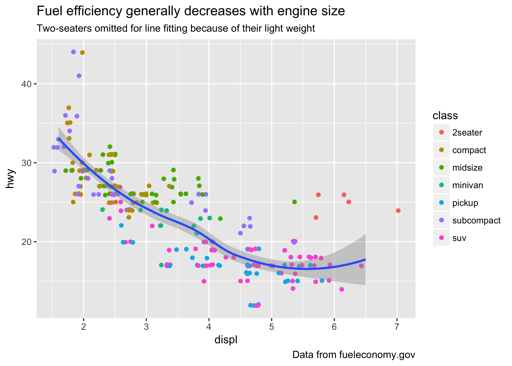

3.  **Take an exploratory graphic that you've created in the last month, and add
    informative titles to make it easier for others to understand.**
    

```r
require(forcats)
rincome_simple <- gss_cat

rincome_simple$rincome <- fct_lump(gss_cat$rincome) %>%
  fct_collapse(
    "<5000" = c("Lt $1000", "$1000 to 2999", "$3000 to 3999", "$4000 to 4999"),
    "5000-14999" = c("$5000 to 5999", "$6000 to 6999", "$7000 to 7999", "$8000 to 9999", "$10000 - 14999"),
    "15000+" = c("$15000 - 19999", "$20000 - 24999", "$25000 or more")
  )

filter(rincome_simple, rincome == "<5000" | rincome == "5000-14999" | rincome == "15000+") %>%
  ggplot()+
  geom_bar(aes(rincome)) +
  labs(
    title = "Most respondents reported incomes greater than $15k",
    x = "Reported income",
    y = "Number of respondents"
  )
```

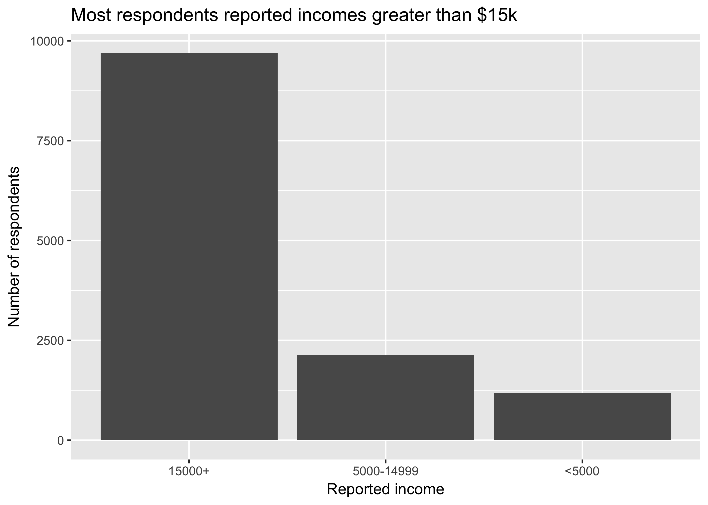

## 28.3.1 Exercises

1.  **Use `geom_text()` with infinite positions to place text at the
    four corners of the plot.**
    

```r
label_tr <- tibble(
  displ = Inf,
  hwy = Inf)

label_tl <- tibble(
  displ = -Inf,
  hwy = Inf)

label_br <- tibble(
  displ = Inf,
  hwy = -Inf)

label_bl <- tibble(
  displ = -Inf,
  hwy = -Inf)

ggplot(mpg, aes(displ, hwy)) +
  geom_point() +
  geom_text(aes(label="top right"), data=label_tr, vjust="top", hjust="right") + geom_text(aes(label="top left"), data=label_tl, vjust="top", hjust="left") + geom_text(aes(label="bottom right"), data=label_br, vjust="bottom", hjust="right") + geom_text(aes(label="bottom left"), data=label_bl, vjust="bottom", hjust="left")
```

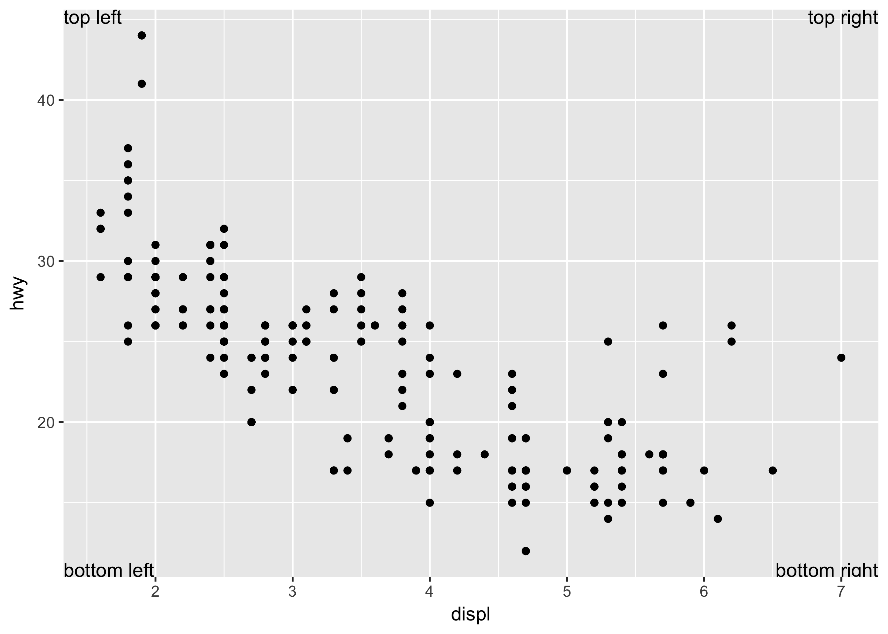

2.  **Read the documentation for `annotate()`. How can you use it to add a text
    label to a plot without having to create a tibble?**
    
Takes arguments `x =` and `y =` so you can specify individual sets of coordinates quickly.    

```r
p <- ggplot(mtcars, aes(x = wt, y = mpg)) + geom_point()
p + annotate("text", x = 4, y = 25, label = "Some text")
```

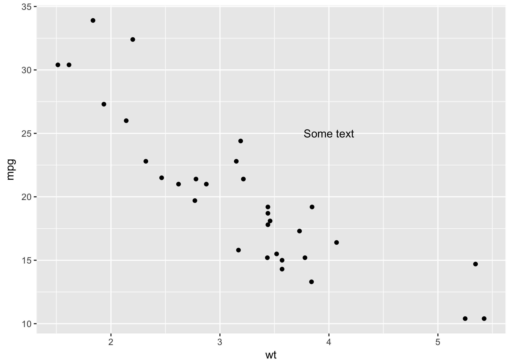

3.  **How do labels with `geom_text()` interact with faceting? How can you
    add a label to a single facet? How can you put a different label in
    each facet? (Hint: think about the underlying data.)**
    
    Labels are applied to every facet by default.

```r
ggplot(data = mpg, mapping = aes(x = displ, y = hwy)) + 
  geom_point() + 
  geom_text(aes(label = model)) +
  facet_wrap(~ class, nrow = 2) 
```

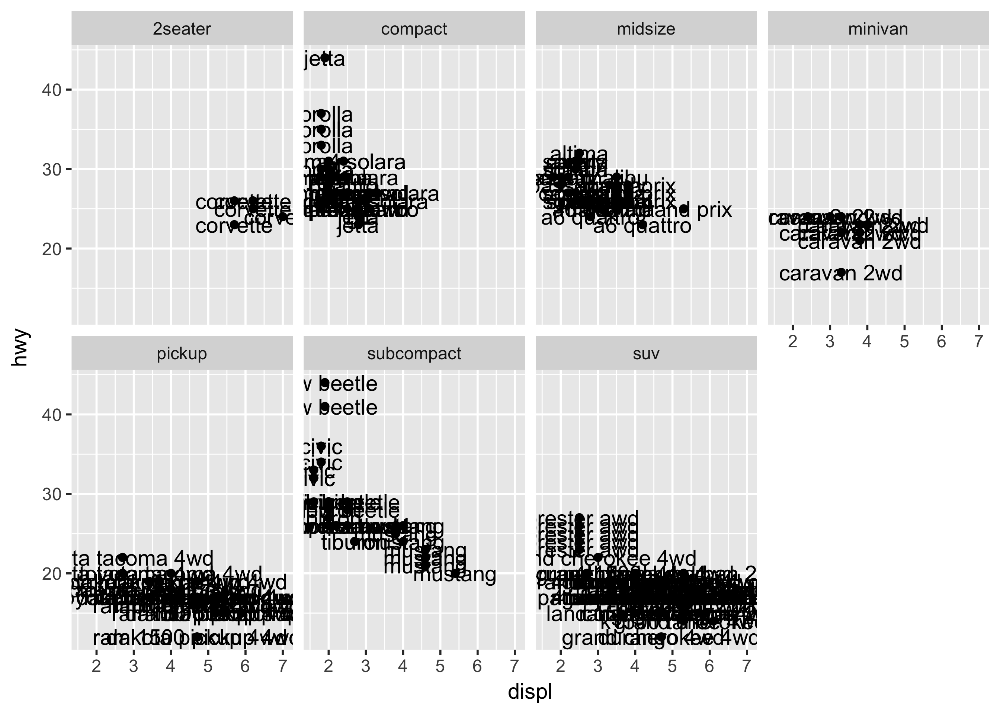

You can set the data for geom_text to a new custom data source that contains a the value(s) of the faceting variable for which you want to add a label.

```r
label_df <- tibble(
  displ = Inf,
  hwy = Inf,
  class = "compact",
  label = "Compacts demonstrate more dramatic efficiency \ngradients, perhaps due to extremely efficient outliers."
)

ggplot(mpg, aes(displ, hwy)) +
  geom_point() +
  geom_text(aes(label = label), data = label_df, size = 1.5, vjust = "top", hjust = "right") +
  geom_smooth(se = F, method = "lm") +
  facet_wrap( ~ class)
```

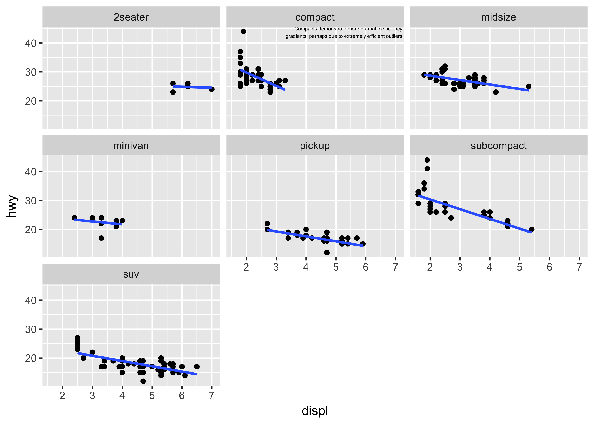

4.  **What arguments to `geom_label()` control the appearance of the background
    box?**
    
   `label.padding`, `label.r`, `label.size`, also `alpha` & `color` via aesthetics.

5.  **What are the four arguments to `arrow()`? How do they work? Create a series
    of plots that demonstrate the most important options.**
    
    `angle`, `length`, `ends`, `type`. Angle takes degrees to determine the fatness of the arrowhead. length = unit(_value_, "_unit_"). Ends takes `first`, `last`, or `both` to determine which end gets an arrowhead (default is last). type gets `open` or `closed` to display a filled or hollow arrowhead (default is open).
    

```r
df <- tibble(a = (1:5),
             b = (6:10),
             c = (11:15))

arw1 <- arrow(angle = 40, length = unit(50, "bigpts"))
arw2 <- arrow(angle = 20, length = unit(10, "bigpts"))
arw3 <- arrow(angle = 40, length = unit(20, "bigpts"), type = "closed")

qplot(data = df, x = a, y = b) +
  geom_segment(x = 2, y = 7, xend = 4, yend = 9, arrow = arw1)

qplot(data = df, x = a, y = b) +
  geom_segment(x = 2, y = 7, xend = 4, yend = 9, arrow = arw2)

qplot(data = df, x = a, y = b) +
  geom_segment(x = 2, y = 7, xend = 4, yend = 9, arrow = arw3)
```
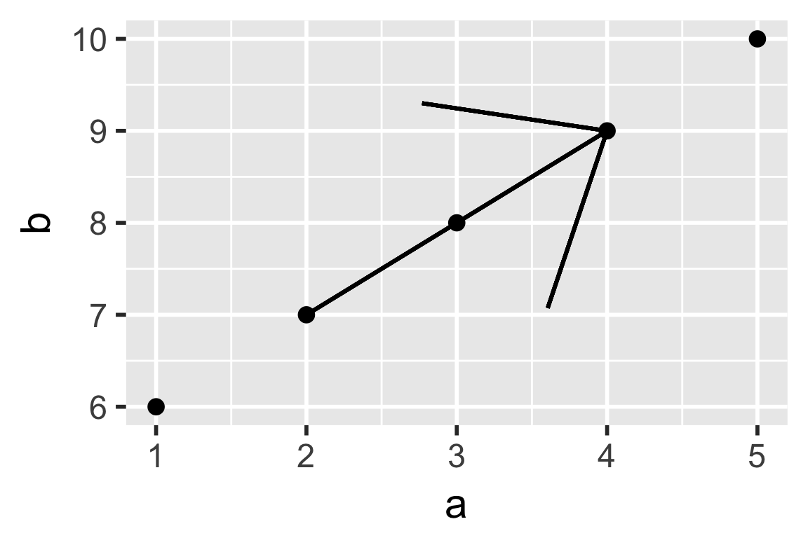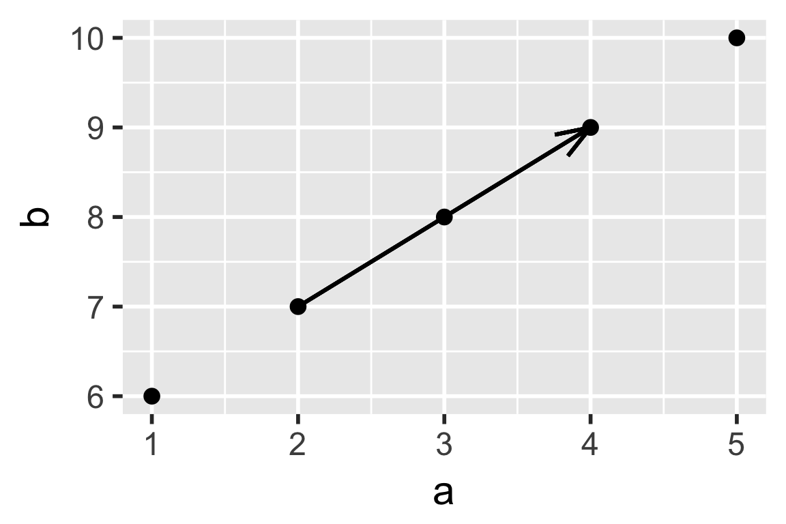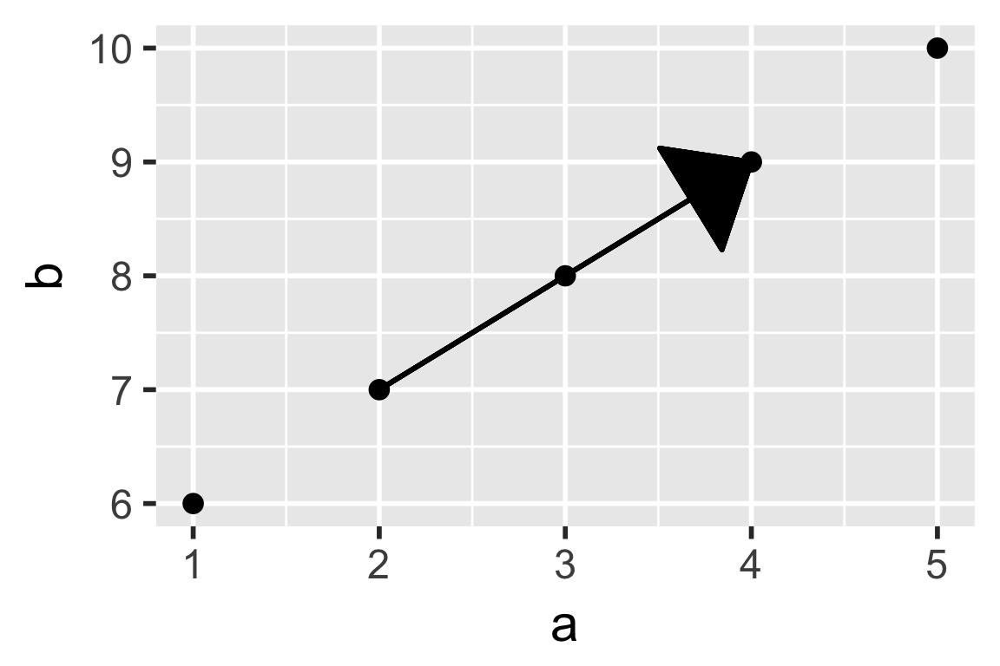

## 28.4.4 Exercises

1.  Why doesn't the following code override the default scale?

    
    ```r
    df <- tibble(
      x = rnorm(10000),
      y = rnorm(10000)
    )
    
    ggplot(df, aes(x, y)) +
      geom_hex() +
      scale_colour_gradient(low = "white", high = "red") +
      coord_fixed()
    ```
Color scale isn't overwritten because the appropriate function would be `scale_fill_gradient()`. The coordinate scale, however, is overwritten by `coord_fixed()`.

2.  What is the first argument to every scale? How does it compare to `labs()`?

The first argument for every scale is `name`. Does the same thing as xlab(), for example.

3.  Change the display of the presidential terms by:

    1. Combining the two variants shown above.
    2. Improving the display of the y axis.
    3. Labelling each term with the name of the president.
    4. Adding informative plot labels.
    5. Placing breaks every 4 years (this is trickier than it seems!).
    
    

```r
presidential2 <- presidential %>%
  mutate(id = as.integer(33 + row_number())) # Create president number

# Create column w/ ordinal rank of prez # & name
presidential2 <- presidential2 %>% 
mutate(presidents = paste0(as.character(name), ", ", sapply(id, toOrdinal::toOrdinal)),
       presidents = factor(presidents, levels = presidents))

# Set up breaks variable for x axis (every 4 years)
year_var <- make_date(seq(year(presidential$start[1]),year(presidential$start[length(presidential$start[])])+8, by = 4))

#plot it
ggplot(presidential2, aes(start, presidents, color = party)) +
    geom_point() +
    geom_segment(aes(xend = end, yend = presidents)) +
    scale_colour_manual(values = c(Republican = "red", Democratic = "blue")) +
    scale_y_discrete() + # labels = c(as.character(presidents))
      scale_x_date(
        breaks = year_var,
        date_labels = "'%y"
        ) +
  labs(title = "Republicans dominate presidencies 1953–present",
       x = "Year",
       y = "President, nth")
```

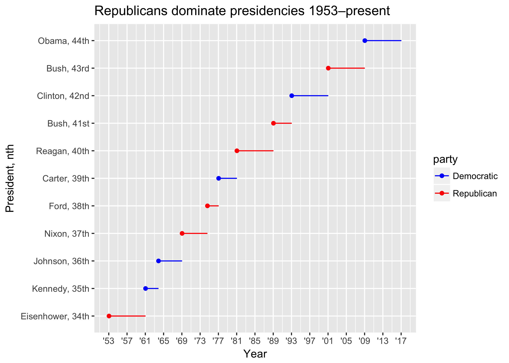

4.  Use `override.aes` to make the legend on the following plot easier to see.

    
    ```r
    ggplot(diamonds, aes(carat, price)) +
      geom_point(aes(colour = cut), alpha = 1/20) +
      guides(color = guide_legend(override.aes = list(alpha = 1))) # this works! right in the documentation examples, too.
    ```
    
    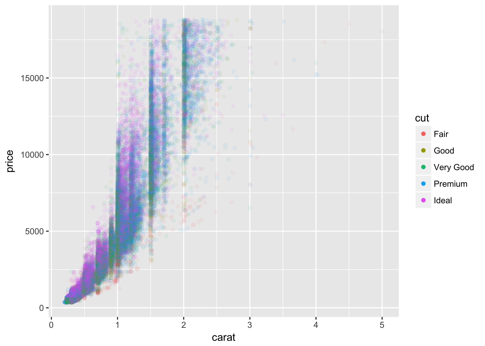
