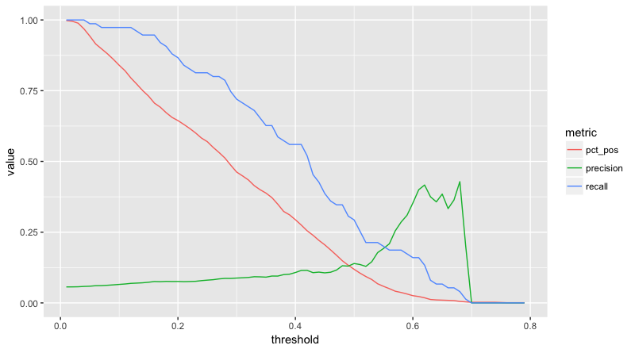

```{r setup, include=FALSE}
knitr::opts_chunk$set(echo = TRUE, fig.retina = 4)
library(tidyverse)
```

## Get Data  

This is data on the predicitons from a model $Pr(y = 1)$ and their truth labels $y \in \{0, 1\}$ for 1,330 examples.

```{r}
# read in model output w/ prediction scores & actual condition values
test_probs <- read_csv("test_predictions.csv")

# take a look
ggplot(test_probs, aes(prediction, fill = as.factor(truth))) +
    geom_density(alpha = 0.7)
```

## The Problem
### _(See my solution in last chunk)_

We would like to look at two metrics of model fitness for a variety of probability thresholds: precision and recall. Precision is ratio of correctly identified positive cases to the total number of predicted positive cases; this is a measure of how discerning a model is. Recall is the ratio of correctly identified positive cases to the total number of actual positive cases; this is a measure at how well your model captures all positive cases. There is an inherent trade-off between these two metrics; at the extreme, one could imagine perfect recall by predicting all cases to be positive, but this would result in a poor precision.

Below is inefficient code for calculating these two metrics for a variety of probability thresholds. First, walk through the code and add comments explaining what each section is doing. Then, write a function to make this code much more efficient.

```{r}
positive_case <- 1 # treat 1 as positive case
thresholds <- c(0.4, 0.5, 0.6) # view recall and precision at these thresholds
truth_bool <- test_probs$truth == positive_case

# create variable with TRUE for scores over threshhold
predict_40 <- test_probs$prediction > thresholds[1]
true_pos_40 <- sum(predict_40 & truth_bool) # these yield logicals
true_neg_40 <- sum(!predict_40 & !truth_bool)
false_pos_40 <- sum(predict_40 & !truth_bool) # They're the 4 accuracy rates
false_neg_40 <- sum(!predict_40 & truth_bool)
n <- length(predict_40)
# calculate precision
precision_40 <- ifelse(true_pos_40 + false_pos_40 == 0, 0, true_pos_40 / (true_pos_40 + false_pos_40))
# calculate recall (is this similar to specificity?)
recall_40 <- ifelse(true_pos_40 + false_neg_40 == 0, 0, true_pos_40 / (true_pos_40 + false_neg_40))
# percentage of set predicted positive
pct_pos_40 <- (true_pos_40 + false_pos_40) / n
metrics_40 <- list(
    threshold = thresholds[1], 
    precision = precision_40, 
    recall = recall_40, 
    pct_pos = pct_pos_40
)

# same as above for next threshold
predict_50 <- test_probs$prediction > thresholds[2]
true_pos_50 <- sum(predict_50 & truth_bool)
true_neg_50 <- sum(!predict_50 & !truth_bool)
false_pos_50 <- sum(predict_50 & !truth_bool)
false_neg_50 <- sum(!predict_50 & truth_bool)
n <- length(predict_50)
precision_50 <- ifelse(true_pos_50 + false_pos_50 == 0, 0, true_pos_50 / (true_pos_50 + false_pos_50))
recall_50 <- ifelse(true_pos_50 + false_neg_50 == 0, 0, true_pos_50 / (true_pos_50 + false_neg_50))
pct_pos_50 <- (true_pos_50 + false_pos_50) / n
metrics_50 <- list(
    threshold = thresholds[2], 
    precision = precision_50, 
    recall = recall_50, 
    pct_pos = pct_pos_50
)

# etcetera
predict_60 <- test_probs$prediction > thresholds[3]
true_pos_60 <- sum(predict_60 & truth_bool)
true_neg_60 <- sum(!predict_60 & !truth_bool)
false_pos_60 <- sum(predict_60 & !truth_bool)
false_neg_60 <- sum(!predict_60 & truth_bool)
n <- length(predict_60)
precision_60 <- ifelse(true_pos_60 + false_pos_60 == 0, 0, true_pos_60 / (true_pos_60 + false_pos_60))
recall_60 <- ifelse(true_pos_60 + false_neg_60 == 0, 0, true_pos_60 / (true_pos_60 + false_neg_60))
pct_pos_60 <- (true_pos_60 + false_pos_60) / n
metrics_60 <- list(
    threshold = thresholds[3], 
    precision = precision_60, 
    recall = recall_60, 
    pct_pos = pct_pos_60
)

# combine accuracy statistics for each threshold into one object
classification_report <- bind_rows(as_data_frame(metrics_40), as_data_frame(metrics_50), as_data_frame(metrics_60))
# classification_report <- purrr::map_df(list(metrics_40, metrics_50, metrics_60), ~as_data_frame(.x)) # equivalent to above

# feed to ggplot
classification_report %>% 
    # filter(pct_pos > 0) %>% # not strictly necessary for our data here
    gather("metric", "value", 2:4) %>% 
    ggplot(aes(threshold, value, color = metric)) +
    geom_line()
```

You can see that as precision is increased, recall is decreased.

## Final goal

We would like to see these metrics for a continuum of thresholds between 0 and 1, to create a plot that looks like this:



```{r}
# define a function, thresholds, with a for loop to run inner function, metrics, for every value of num_thresholds
# input is a data set (set), number of thresholds (num_thresholds), and the number to use as the positive case (usually 1)
thresholds <- function(set, num_thresholds, positive_case) {
  # pre-allowcate memory for for loop output by creating classification_report
threshold <- tibble(threshold = vector("double", num_thresholds))
precision <- tibble(precision = vector("double", num_thresholds))
recall <- tibble(recall = vector("double", num_thresholds))
pct_pos <- tibble(pct_pos = vector("double", num_thresholds))
classification_report <- bind_cols(threshold, precision, recall, pct_pos)
i <- 1
# iterate over 100 rows of classification_report & calculate metrics for each threshold
  for (i in (i:num_thresholds)) {
    thresh <- (i/num_thresholds)
    classification_report[i,] <- as_data_frame(metrics(set, thresh, positive_case))[1,]
  }
  return(classification_report);
}

# define a function, metrics, for figuring precision & recall
# takes a dataset, a threshold, and the value to be used as the positive case
# returns the threshold, precision, recall & percent marked positive as a list
metrics <- function(set, threshold, positive_case) {
  # redefining this within the scope of this function for flexibility
  truth_bool <- test_probs$truth == positive_case
  # create variable with TRUE for scores over threshhold
  predict <- set$prediction > threshold
  true_pos <- sum(predict & truth_bool) # I think these yield logicals
  true_neg <- sum(!predict & !truth_bool) # Or maybe 1s & 0s as int
  false_pos <- sum(predict & !truth_bool) # They're the 4 accuracy rates
  false_neg <- sum(!predict & truth_bool)
  n <- length(predict)
  # calculate precision
  precision <- ifelse(true_pos + false_pos == 0, 0, true_pos / (true_pos + false_pos))
  # calculate recall (is this similar to specificity?)
  recall <- ifelse(true_pos + false_neg == 0, 0, true_pos / (true_pos + false_neg))
  # percentage of set predicted positive
  pct_pos <- (true_pos + false_pos) / n
  metrics <- list(
      thresholds = threshold, 
      precision = precision, 
      recall = recall, 
      pct_pos = pct_pos)
  return(metrics);
}

# Run thresholds w/ data, 100 thresholds, 1 = positive; pass output to ggplot
# Try it with other numbers of thresholds! 1000, 300, 50
thresholds(test_probs, 100, 1) %>% 
    filter(pct_pos > 0) %>%
    gather("metric", "value", 2:4) %>% 
    ggplot(aes(threshold, value, color = metric)) +
    geom_line()
```

